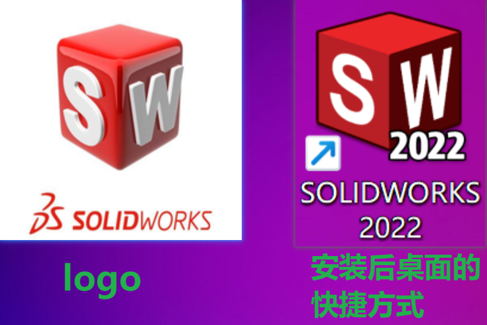
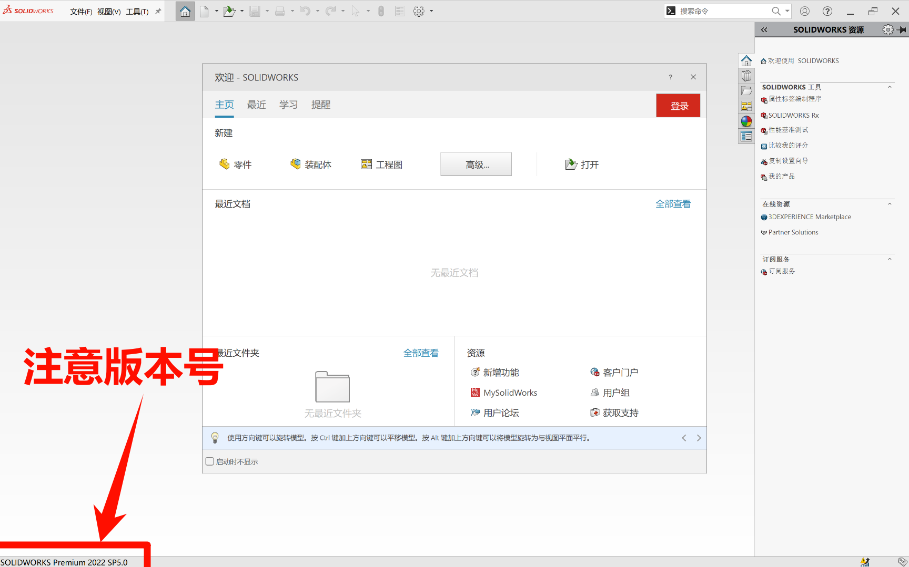
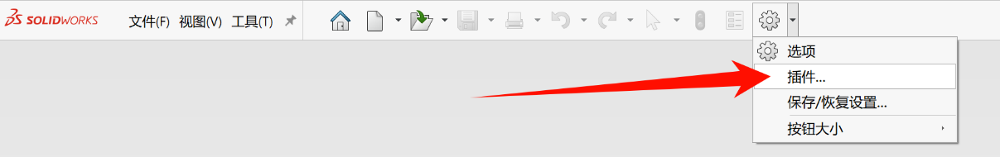
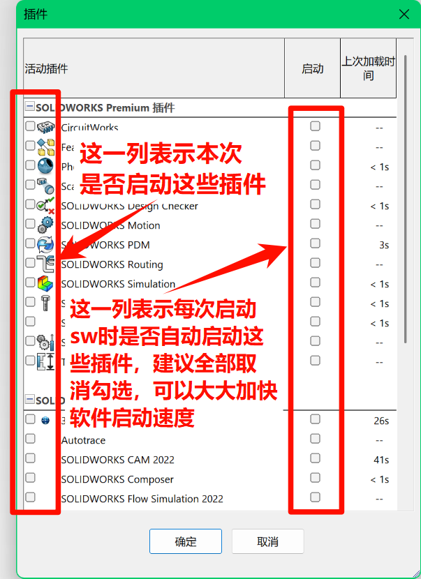
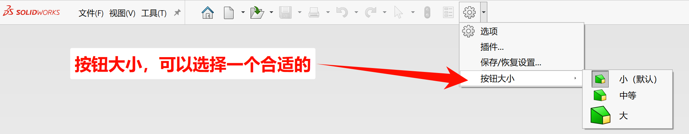
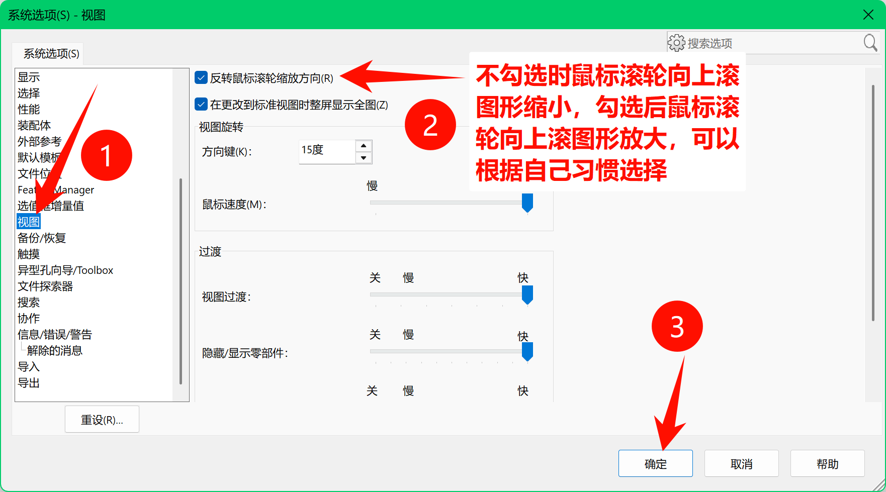
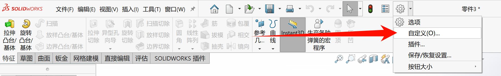
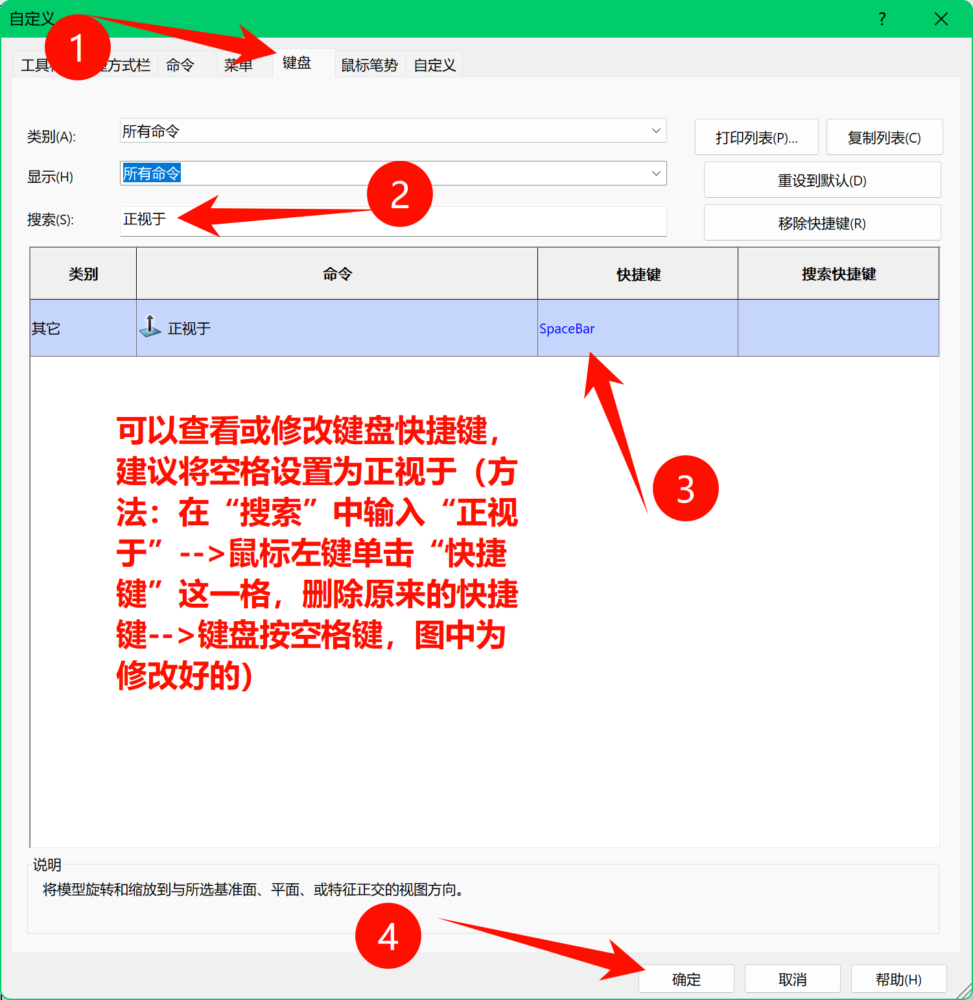
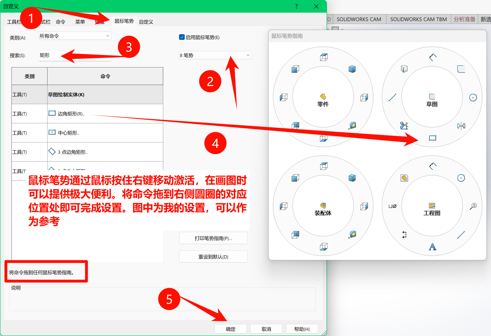
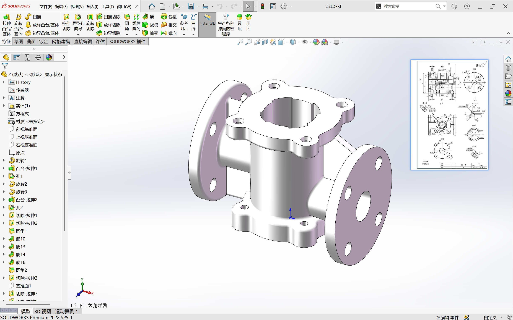

# 机械组学习思路

## 主要软件安装与设置
### 软件安装

基地使用**SOLIDWORKS 2022 SP5.0** 。可以自己在网上找安装教程，或者在某宝上找人代装。安装遇到问题要学会上网查询解决方法，要知道你碰到的问题大部分都能在网上找到解决方法。

（如果有很多快捷方式，只保留这一个就行，其余快捷方式可以删除）

安装后会显示下面的界面

### 软件设置
恰当的设置可以大大加快我们画图的速度，以下设置可以作为参考，也可以自行去网上（B站等）查询solidworks推荐的设置。

#### 插件设置

#### 按钮大小

#### 滚轮方向设置

#### 自定义设置
（需要先打开或新建一个零件才能找到）

##### 键盘快捷键

##### 鼠标笔势

## 辅助工具
### 贴图工具
当我们对照工程图画图时，来回切换很麻烦，可以使用某些软件将图片固定在屏幕最上层，方便查看（如图）。

使用的软件： **Snipaste** 或 **PixPin** ，应该在软件商店就可以安装，具体使用方法自行查看教程或上网查询。

### 其余工具
其余工具会在后续培训过程中逐步向你们介绍。

## 学习内容
### 看图纸
可以看懂简单的图纸，并能将其使用solidworks画出来（如上图）
### solidworks的基本使用方法

可以在B站寻找教学视频，如
> [阿奇设计分享：SOLIDWORKS 教学 精品教程](https://www.bilibili.com/video/BV1iw411Z7HZ)

### 对一些简单的物体建模
学习solidworks基本使用方法后，就可以思考或尝试用solidworks画生活中常见物体，这样可以快速熟悉solidworks的使用。同时可以在B站留意一些up主分享的**solidworks的小技巧**和**对一些比较难的物体的建模**，从中可以学到一些建模思路或一些solidworks不太常用但对某些特殊情况有奇效的功能。如
> [SolidWorks必会的五种标注小技巧](https://www.bilibili.com/video/BV1Cj2mY8Eqc)
> [SolidWorks中柔性弹簧的动画制作，其实很简单！](https://www.bilibili.com/video/BV1oxu8zJErq)
> [SolidWorks中如何快速完成圆弧面凹槽的绘制](https://www.bilibili.com/video/BV1HDbSzYEz3)
> [【SW曲面建模】握力器曲面综合案例！从建模到细节，全流程教程来啦～](https://www.bilibili.com/video/BV12fhbzWEr3)
> [solidworks圆管压扁绘制，很随意就会了](https://www.bilibili.com/video/BV1Wz42187Tu)
> [4分钟学会SolidWorks中锥齿轮的装配，再也不怕齿轮干涉了!](https://www.bilibili.com/video/BV1k6JJzxEKv)

B站上这类视频很多，平时要多留意。当你对solidworks足够熟悉并对各种结构都能在solidworks中画出来，你才能在后续考核甚至进基地后把你想出来的结构用solidworks实现，而不是仅仅停留在想象阶段。

### 各项目组后续的学习内容
各项目组需要学习的内容各不相同，具体内容后续分组后学长学姐会说。