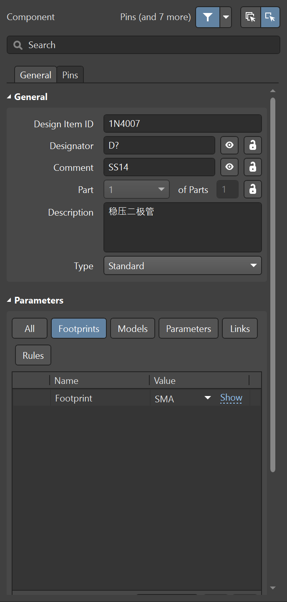
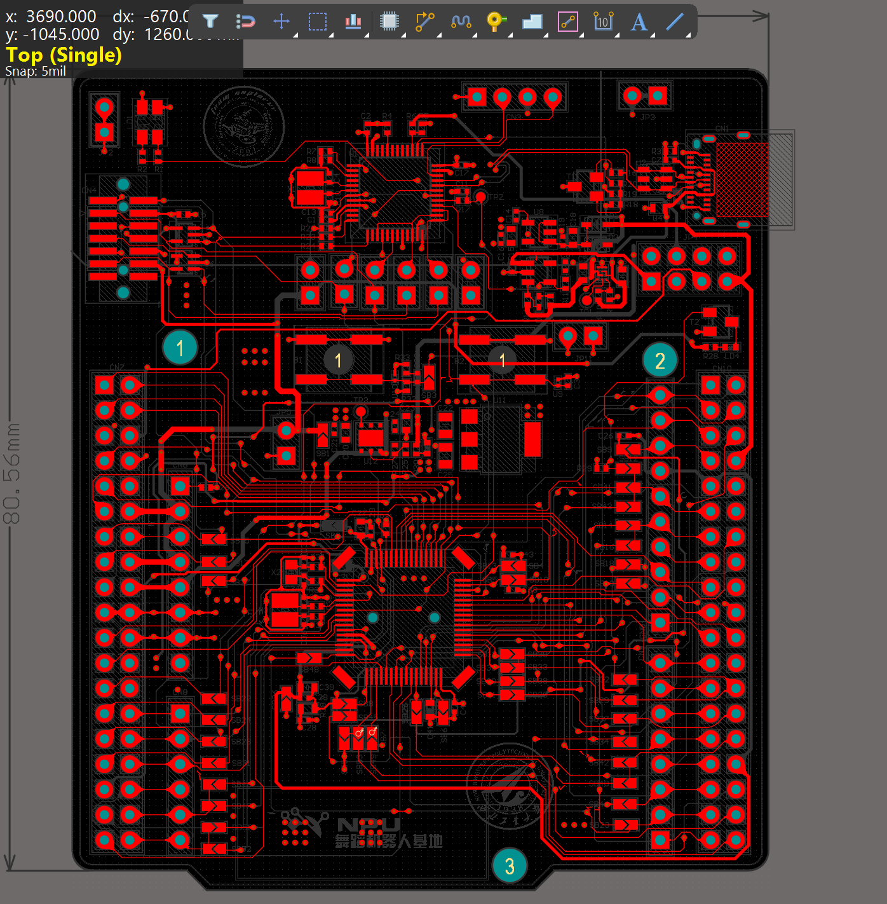

# AD简要介绍

## 前言

> 由于B站上的教程大多都较为抽象，在入门学习的时候会有许多懵逼之处，因此创作此文档帮助新手快速入门。但很多都是根据自己的理解讲述，可能不一定准确，也不是很全面，但应该能帮助新手快速了解，后续还需大家通过多实践深入掌握。

## 下载

自己去B站上搜安装教程吧，版本不需要太新，安装后破解汉化。

## 工程创建

现介绍工程所需的4个步骤，再介绍四个分别干什么。

- 创建原理图

- 创建PCB
- 创建元件库和原理图库

创建后保存命名，结构如下：

## 工程文件介绍

从上到下分别为==**PCB 文件（.PcbDoc）**==、**PCB 封装库（.PcbLib）**、==**原理图文件（.SchDoc）**==、**原理图库（.SchLib）**、工程文件。

### PCB文件

最终绘制出的PCB板文件，**实际电路图**的形状大小、元件放置位置、连接与走线均以它为准。

### PCB 封装库

把原理图里的 “抽象符号” 和现实中的 **“实体元件” 对应**起来，知道元件、焊盘的具体大小，直接决定了元件能不能焊到电路板上。

### 原理图文件

用符号和线条告诉你：**各个元件之间是怎么用电线连起来的**。这里的 “符号” 不考虑元件实际大小（比如电阻是画成长方形还是波浪线），只关注 “谁和谁相连” 这个逻辑关系。同时它导出的PCB文件中的飞线连接也以它相对应的网络编号为准。

### 原理图库

元件的 “原理图符号”，让人一眼就看懂件管脚号和功能。

## 实际流程

1. 先从**原理图库**里调出元件符号，在**原理图文件**里画好电路逻辑；
2. 再从**PCB 封装库**里调出对应元件的 “脚印”，根据原理图的连接关系，在**PCB 文件**里安排元件位置、画铜皮导线；
3. 导出genber文件交给工厂，就能做出实际的电路板了。

## 原理图库（.SchLib）

### 核心部分：

1. #### 图形符号（外观）

这些图形只是 “示意图”，不反映元件实际大小，只要能让人一眼认出是什么元件就行。

2. #### **管脚（Pins）—— 最关键的部分**

管脚是符号上的 “小短线”，但它不是普通的线条，而是有 “电气属性” 的：

- 每个管脚都有编号（比如芯片的 1 脚、2 脚……），必须和实际元件的管脚号对应（比如芯片手册上的 1 脚是 VCC，符号上的 1 脚也得表示 VCC，Name自然也采用VCC）。
- 管脚有 “电气类型”（比如输入、输出、电源、接地），软件会根据类型检查电路连接是否合理（比如电源脚不能直接接输出脚）。
- 管脚还有 “长度”“显示名称” 等属性（比如把管脚 1 的名称标为 “VCC”，方便看图时知道这个脚接电源）。

##### **重点关注：**

- ###### **`Designator`:**

- 就是引脚的 “序号”，比如芯片的 1 脚、2 脚、3 脚……

- **必须和实际元件的 datasheet（数据手册）完全一致**！比如手册上 1 脚是 VCC，你画的引脚 1 就必须对应 VCC 功能，错一个数字整个电路就可能接反。(相关内容可以在数据手册中找到)

- 作用：软件通过引脚编号关联原理图和 **PCB 封装（封装的焊盘编号也要和这里一致）**，是 “物理引脚” 和 “逻辑符号” 的唯一对应凭证。

- ###### `Name`:

- 标注引脚的 “功能用途”，比如 “VCC”（电源）、“GND”（地）、“IN”（输入）、“OUT”（输出）。

- 作用：画原理图时能直观知道这个引脚该接什么，比如看到 “GND” 就知道要接地线，看到 “TX” 就知道是发送信号。

3. #### 元件属性（Properties）

元件名称、元件型号、封装链接（与PCB 封装库相关联，同一个符号也可以对应多个封装，例如公母的接口）

> 这个基本都有现成的库，可以在嘉立创进行下载。当然，项目组基本都会传下需要的器件。

## 原理图文件（.SchDoc）

### 网络标签

​	图中导线的连接就代表实际线路的连接，在少量元件时还可以接受，但是当连接的元件一多，且间隔较远时，全用导线直接相连所有外设时可读性极差，因此采用网络标签的形式。

​	**相同的网络标签就代表了实际线路的相连。**以此图为例。在原理图上，这两个模块距离较远，但使用相同的`340+`、`340-`网络标签就代表了在实际线路中是相连的。`GND`、`VCC`网络标签的使用也使电源的流向十分清晰。

- USB通信

- 供电

[]

### 模块划分

​	将同一模块相关电路放在一起（包括滤波电容就近摆放），并与其他功能的模块分离，并加上注释，使人一目了然。当较为复杂时也可以分原理图描述，当然这也是后话了。

### 简要标注

​	下面两个电阻分别是1K和10K，它们的分装都是0603，也就是说电路板上他们长的一模一样，但是实际焊接时还是要正确对应阻值，因此即使在`Comment`中记录一下它的数值对后续焊接和传承也是挺重要的。

## PCB 封装库（.PcbLib）

相关的尺寸大小均可在数据手册中获取(了解即可,一般有现成的)

###  **PCB封装库的作用**

- **定义元件实物焊盘**：将原理图符号（.SchLib）映射到实际电路板上的物理焊盘和外形。
- **确保可制造性**：封装的尺寸、间距必须符合元件规格（如芯片引脚间距、焊盘大小等）。
- **与原理图关联**：封装焊盘的编号（Designator）必须与原理图符号的引脚编号一一对应。

### **PCB封装的核心内容**

#### **(1) 焊盘（Pads）**

- **作用**：元件引脚焊接的金属区域。
- **关键属性**：
	- **编号（Designator）**：必须与原理图引脚编号一致（如原理图引脚“1”对应焊盘“1”）。
	- **形状/尺寸**：圆形、矩形等，需根据元件规格（如贴片电阻焊盘长宽）。
	- **类型**：通孔（Through Hole）或贴片（Surface Mount）。

显示在**top layer**层

#### **(2) 元件外形（Silkscreen）**

- **作用**：用丝印层（Top Overlay）绘制元件轮廓，辅助人工焊接和调试。
- **示例**：
	- 贴片电阻：矩形框标注方向和位号（如“R1”）。
	- 芯片：引脚1的圆点或缺口标记。

显示在**top overlay**层

#### **(3) 3D模型（可选）**

- 为封装添加3D体（3D Body），便于检查机械干涉（如散热器高度）。

**mechanical**层及其对应3D模型

可在[IC封装网 - 行业IPC标准电子元件库](https://www.iclib.com/)中下载或者让机械的同学用solidworks绘制:smirk:

#### **(4) 阻焊层（Solder Mask）**

- 默认焊盘区域会开窗（露出铜），非焊盘区域覆盖阻焊油墨（防短路）。

- 该层的图形是 **阻焊层需要“挖空”的地方**，露出铜皮以便焊接。

**Top Solder**层

> PS：阻焊油墨覆盖非焊接区域，防止焊接短路，**开窗通常比焊盘大**，以确保焊盘完全暴露。就是刻板印象中绿色的油墨，实际上可以做成彩色的:grin:

## PCB 文件（.PcbDoc）

**PCB文件（.PcbDoc）** 是Altium Designer中用于设计印刷电路板（Printed Circuit Board）的核心文件，包含元件的物理布局、走线、层叠结构等信息。下面从**核心功能、设计流程、关键操作及注意事项**等方面详细介绍。

------

### **PCB文件的核心内容**

#### **(1) 电路板物理结构**

- **板框（Board Outline）**：定义PCB的外形尺寸（在`Mechanical 1`层绘制）。
- **层叠结构（Layer Stackup）**：包括信号层、电源层、阻焊层等（如2层板、4层板）。
- **孔和槽**：通孔、安装孔等。

#### **(2) 元件布局（Placement）**

- 从原理图导入的元件（Footprint），需合理摆放以优化信号和散热。
- 接口等模块需要合理放置，便于连接。

#### **(3) 走线（Routing）**

- **信号线（Signal Traces）**：连接元件引脚，需考虑线宽、间距、阻抗等。
- **电源/地线（Power Planes）**：通常用覆铜（Polygon Pour）或专用电源层。
- **差分对（Differential Pairs）**：如USB等高速信号需等长、等距走线（其实我们大多是低速板，考虑不是很严）。

#### **(4) 覆铜（Polygon Pour）**

- 大面积铜皮用于接地（GND）或电源（如3.3V），可减少噪声和散热。
- **类型**：实心铜（Solid）、网格铜（Hatched）。

#### **(5) 设计规则（Design Rules）**

- 约束线宽、间距、过孔尺寸等，确保可制造性（通过`Design → Rules`设置）。

### 物理结构

​	板框外形尺寸根据实际需求以及元件数量决定，通常使用2层板就够了，4层更贵，但可能更好画。安装孔根据实际需求确定。

> 四层板层叠示意

### 元件布局

​	在绘制原理图时采用分模块绘制，同样在PCB绘制时也根据原理图进行绘制，通常将同一模块内容放置在一起（开启交叉选择模式快速定位）。同时要理解原理图中的连接顺序，特别是电源的流向，先经过大电容，再经过小电容滤波要清楚，电容滤谁的波放在谁旁边。

​	同时还要考虑焊接的问题，别放的密密麻麻，自己都焊不了（也可以加钱用STM贴片🤑）。

### 走线与铺铜

#### 介绍

​	通常两层板中每层均是`Signal`层（正片层），电路板中走线与铜皮的连接就代表实际线路连接。（负片层相反，类似阴刻阳刻）。

​	在两层板中有两层的走线区域，当当前层走线难以通过时，可以采用过孔连接到另一层继续布线。四层板中加入了`GND` 、`POWER`层的概念，实际上信号走线的还是两层区域。(强烈建议在初学时==**不要用自动布线**==，尝试自己优化布局和走线，不要用减小走线和过孔的方法尝试自动布线连通)

​	由于单根导线载流能力有限，电源信号通常采用铺铜方式（或粗线）进行连接，可以承载更大电流。铺铜是在PCB空白区域覆盖铜，但也要与走线保持间距。

- Top Layer

- 粗暴的布线与精细的布线​😅​

- Bottom Layer

- 正负层铺铜

- 可以在铺铜管理器中对所有铜皮进行重新设置

> 可以看出图中的铜皮有少部分尖锐铜皮，在高频信号下可能产生问题，可修改相关参数或设置禁止铺铜区消除。

#### 走线注意

1. 合理**选择线宽**，太宽走线没位置，太小要么做不出，要么嘎嘎费钱。
2. **间距控制**，线路之间要保持合理间距，也受工艺限制。
3. **避免直角走线**（用45°或圆弧），减少信号反射。
4. **电源线**：根据电流加宽，最好使用铺铜。
5. **层间切换**：通过**过孔（Via）**跨层，注意减少过孔数量。

#### 铺铜注意

1. **网络选择**：优先铺地（GND）铜，形成完整参考平面。
2. **铜皮间距**：与走线/焊盘保持间距。
3. **焊盘连接方式**：十字连接、全连接。
4. **孤岛铜皮**：删除或通过过孔接地，使用工具自动移除死铜。
5. **工艺要求**：铜箔边缘倒圆角（防尖端放电）。

### 设计规则

​	要符合实际生产规格，给出嘉立创基本的工艺尺寸。详细见官网。

#### **1、孔径要求**

■ ==**单面和双面板最小过孔：内径0.3mm(11.8110236mil)/外径0.5mm(19.6850394mil)**==（单面铝基板最小钻孔1.0mm）

**■ 四层和六层板最小过孔：内径0.2mm/外径0.45mm（外径极限0.40mm）**

#### **2、线路制作**

==**■ 单面和双面板最小线宽线隙：0.127/0.127mm(5mil)(极限0.1/0.1mm)**==

**■ 四层和六层板最小线宽线隙：0.09/0.09mm**

#### 3、收费标准

1）==**单，双面板： 长宽在5cm以内，打样10pcs 价格是50元/款，包含了所有费用**==（包含了快递费，省外及用顺丰快递除外）

2）==**单，双面板： 长宽在10cm以内，打样10pcs 价格是100元/款，包含了所有费用**==（包含了快递费，省外及用顺丰快递除外）

​	**主要关注：**

**常用规则**

1. 间距，最起码6mil，一般8mil

2. 连接，最好检查不完整连接，防止虚接

3. 线宽，针对信号和电源线进行分类，设置不同规则

4. 过孔，控制孔径大小

5. 铺铜方式，选择全连接还是十字连接

### 分类

将信号与电源进行分类，在布线规则，飞线隐藏有很大作用。

在PCB选项中对PWR网络进行飞线隐藏，单独设置颜色，网络高亮等操作。

### DRC校验

绘制完成后进行DRC校验。注意此处只针对你定下的规则进行检查，并非代表一定没有问题，也不需要一定没有问题（比如那两条线你就可以选择不连）。所以解决问题的最好办法是更改规则（bushi

## 快捷键

### **Altium Designer 常用快捷键速查表**

采用英文输入法。不全。

#### **1. 通用操作**

|    快捷键    |     功能说明     |    记忆技巧     |
| :----------: | :--------------: | :-------------: |
|  `Ctrl + S`  |     快速保存     |   Save首字母    |
|  `Ctrl + Z`  |     撤销操作     |   通用撤销键    |
| `Ctrl + C/V` |    复制/粘贴     |    通用操作     |
| **`Delete`** | **删除选中对象** | 不是`Backspace` |

#### **2. 原理图设计**

|   快捷键    |        功能说明        |    应用场景     |
| :---------: | :--------------------: | :-------------: |
|   `P + P`   |        放置元件        |   Place Part    |
| **`P + W`** |      **绘制导线**      |   Place Wire    |
| **`P + N`** |    **添加网络标签**    |    Place Net    |
|   `P + B`   |        放置总线        |    Place Bus    |
| **`Space`** | **旋转元件**（放置时） | 每按一次旋转90° |
|    `X/Y`    |   水平/垂直翻转元件    |     X轴/Y轴     |
| **`J + C`** |   **跳转到指定元件**   | Jump Component  |

#### **3. PCB设计**
|          快捷键           |      功能说明      |   专业技巧   |
| :-----------------------: | :----------------: | :----------: |
| **`Ctrl + Shift + 滚轮`** | **打孔并换层布线** |   快速换层   |
|        **`P + V`**        |    **放置过孔**    |  Place Via   |
|      **`Shift + S`**      |  **单层模式切换**  |  检查特定层  |
|        `Ctrl + M`         |      测量距离      |   Measure    |
|            `L`            |      展示设置      |   隐藏铺铜   |
|            `3`            |     3D视图切换     | 3D的直观记忆 |
|    **`Ctrl + Click`**     |  **高亮相同网络**  |  Highlight   |

#### **4. 高效编辑**

|     快捷键      |          功能说明          |  效率提升点  |
| :-------------: | :------------------------: | :----------: |
|    **`Tab`**    | **编辑对象属性（放置时）** | 实时修改参数 |
| **`T + O + L`** |     **矩形区域内排列**     |  交互式选择  |
| `Shift + 空格`  |        切换走线模式        | 45°/90°/圆弧 |

> **提示**：在设置中自定义快捷键。对常用但较为麻烦的如矩形区域内排列设置自己的快捷键，注意冲突。

## 实战资源下载

1. https://app.jingsocial.com/mF/websiteEditorLandingPage/page/f89619ac5b6c46efb6d076332c88ef2f?pushId=eruWqPF45fojbokHtiSGAi
	
	> Note：大部分案例可能对初学者太难了😅
	
2. 23学长整理：链接：https://pan.baidu.com/s/150-1nXvYBgRJi7cGUW5t9g 
	
	> 提取码：94so 

## 视频链接

> 学长亲测

1. 【【完结】极简PCB绘制教程 小白友好 0基础速进 基于Altium】 https://www.bilibili.com/video/BV1d44y1b7Cc/?share_source=copy_web&vd_source=82729cd26839b06e5b227329599ff2ae
2. 【Altium Designer 1小时（貌似不够）速成（可能不止一小时*~* 但我觉得仨小时肯定够了---来自up猪的自信!!）】 https://www.bilibili.com/video/BV17E411x7dR/?share_source=copy_web&vd_source=82729cd26839b06e5b227329599ff2ae

>  闲的慌情况下可接受范围下的挑战（当然我们一般两层板就够了）

【Altium Designer | 4层STM32开发板基础入门实战课程第一课：PCB设计流程规范、网表导入及常见导入错误解决 | AD24 | 直播回放】 https://www.bilibili.com/video/BV1Fr421w7Tb/?share_source=copy_web&vd_source=82729cd26839b06e5b227329599ff2ae

## 总结（废话）

​	这里只是大体的介绍，可以自己去尝试和查阅各个功能。AD的操作还是非常丰富的，但我们往往只需要掌握一小部分，所以不必觉得遥不可及，学长学姐们都是一步步走过来的，用得多了自然就熟。所以不要犹豫了，赶快尝试去绘制自己的第一块板吧！:happy:
